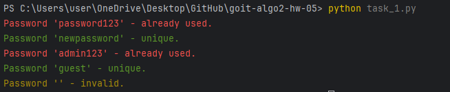
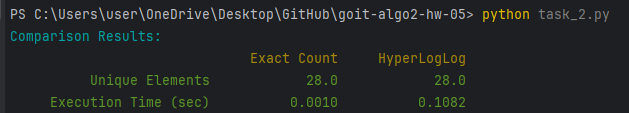

# HW-5 | Algorithms for Big Data Processing

## Welcome! How’s your mood?  
We hope you're eagerly anticipating a new challenge 😉  

Today, you will gain skills in using Bloom filters and the HyperLogLog algorithm
to solve problems.

This homework consists of two independent tasks.

The first task—checking password uniqueness—will prepare you for developing 
systems that handle large-scale data, where memory efficiency and processing 
are critical.

In the second task, you will learn to work with different approaches for 
counting unique elements in large datasets, including both exact methods and 
approximate algorithms like HyperLogLog. You will also gain experience analyzing
algorithm performance using execution time metrics. This task will help you 
develop data optimization skills and apply modern methods for efficient 
problem-solving.

Let's get started! 💪🏼  

---

## Task 1: Checking Password Uniqueness Using a Bloom Filter  

Create a function to check password uniqueness using a Bloom filter. 
This function should determine whether a password has been used before without 
storing the actual passwords.

### **Technical Requirements**  

1. Implement a `BloomFilter` class that supports adding elements to the filter 
and checking for their existence.
2. Implement a `check_password_uniqueness` function that utilizes a `BloomFilter` 
instance to check a list of new passwords for uniqueness. It should return the 
validation results for each password.
3. Ensure proper handling of all data types. Passwords should be processed as 
plain strings without hashing. Empty or invalid values must also be considered 
and handled appropriately.
4. The function and class should be capable of handling large datasets while 
using minimal memory.

### **Acceptance Criteria**  

📌 The acceptance criteria for this homework are mandatory for review by the 
mentor. If any of these criteria are not met, the mentor will return the 
assignment for revision without evaluation.  
If you need "just a clarification" 😉 or get "stuck" at any stage—reach out 
to your mentor on Slack.

1. The `BloomFilter` class correctly implements Bloom filter logic (20 points).
2. The `check_password_uniqueness` function verifies new passwords using the 
provided filter (20 points).
3. The code executes as expected based on given usage examples (10 points).

### **Usage Example**  

```python
if __name__ == "__main__":
    # Initialize Bloom filter
    bloom = BloomFilter(size=1000, num_hashes=3)

    # Add existing passwords
    existing_passwords = ["password123", "admin123", "qwerty123"]
    for password in existing_passwords:
        bloom.add(password)

    # Check new passwords
    new_passwords_to_check = ["password123", "newpassword", "admin123", "guest"]
    results = check_password_uniqueness(bloom, new_passwords_to_check)

    # Print results
    for password, status in results.items():
        print(f"Password '{password}' - {status}.")
```

## Task 2: Comparing HyperLogLog Performance with Exact Unique Element Counting  

Create a script to compare exact unique element counting with the HyperLogLog approximation.

### **Technical Requirements**  

- Load a dataset from a real log file (`lms-stage-access.log`) containing IP address information.  
- Implement a method for exact unique IP address counting using a `set` structure.  
- Implement a method for approximate unique IP address counting using HyperLogLog.  
- Compare both methods in terms of execution time.  

### **Acceptance Criteria**  

1. The data loading method processes the log file while ignoring incorrect lines (**10 points**).  
2. The exact counting function returns the correct number of unique IP addresses (**10 points**).  
3. HyperLogLog provides an approximation within an acceptable error margin (**10 points**).  
4. The comparison results are presented in a table format (**10 points**).  
5. The code is scalable for large datasets (**10 points**).  

### **Example Output**  

**Comparison Results:**  

| Method            | Exact Counting | HyperLogLog |
|------------------|---------------|-------------|
| Unique Elements | 100000.0       | 99652.0     |
| Execution Time (s) | 0.45       | 0.1         |

---

# TASKS' RESULTS

## Task 1

## Task 2
